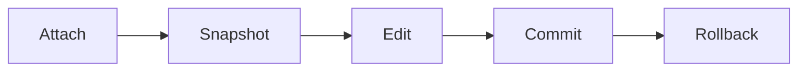

# registry-editor-suite 🗝️⚙️

  

*The registry, finally readable — a precision instrument for the hive mind of your Windows install.*

  

---

## 🧭 Overview

Every Windows machine carries a quiet archive of decisions — settings toggled, drivers installed, apps that came and went leaving behind orphaned keys like fossils. The stock Registry Editor lets you *see* that archive. It doesn't let you *understand* it. **registry-editor-suite** is what happens when a Registry Editor Advanced tool is built by people who actually live inside `regedit` every week — search that doesn't choke on large hives, diffing that shows you exactly what changed, and a UI that doesn't treat every click like a potential act of self-sabotage.

This project started as a personal itch: too many nights spent hunting a single misplaced DWORD across a hive with half a million keys, using tools that felt frozen in 2003. So we rebuilt the experience from the ground up — faster tree rendering, real undo history, safe editing guardrails — without losing the raw access power users demand. No bloat, no telemetry, no nonsense.

It's for the systems tinkerer optimizing boot behavior, the IT technician auditing a fleet of machines, the developer debugging why an installer left ghost keys behind, and the curious learner who wants to actually *understand* HKEY_LOCAL_MACHINE instead of fearing it. If you've ever backed up a `.reg` file "just in case" before touching anything — this is the tool that makes that fear obsolete.

## ⬇️ Get It

---

## 📊 Before / After

| | Stock Registry Editor | registry-editor-suite |
|---|---|---|
| Search across full hive | Minutes, freezes on large trees | Seconds, indexed and incremental |
| Undo | None — you're on your own | Full timeline with rollback points |
| Bulk key editing | One key at a time | Multi-select, batch apply |
| Visual diffing | Not supported | Side-by-side snapshot compare |
| Key/value favorites | Not supported | Pinned, tagged, searchable |
| Theming | Fixed system look | Light, Dark, High Contrast |
| Startup time | Instant, but shallow | Instant, and it actually shows you something useful |
| Safety net | Manual `.reg` export if you remember | Auto-snapshot before every risky operation |

> [!NOTE]
> The stock editor isn't "bad" — it's minimal by design. This suite exists because minimal stopped being enough for advanced registry work a long time ago.

## ⚡ What It Actually Does

- **Instant hive search** — query across HKEY_LOCAL_MACHINE, HKEY_CURRENT_USER, and mounted hives simultaneously, with results ranked by relevance, not just alphabetical order.

- **Snapshot & rollback** — every edit session opens with an automatic checkpoint. Regret a change? Roll the whole session back in one click, not one key at a time.

- **Visual diff engine** — compare two snapshots side-by-side and see exactly which keys were added, removed, or modified, with color-coded deltas instead of guesswork.

- **Batch key operations** — select twenty keys, apply one change. The registry stops being a place where repetition is the only option.

- **Favorites & tagging** — pin the keys you touch often (startup entries, shell overrides, driver flags) so you're never spelunking the same path twice.

- **Permission-aware editing** — the suite flags protected or system-critical keys before you touch them, so advanced access never means reckless access.

- **Import/export with context** — `.reg` files carry notes and timestamps on export, so six months from now you'll remember *why* you changed that value.

- **Live monitoring mode** — watch a key or subtree for changes in real time, invaluable when chasing down what an installer is actually doing under the hood.

> [!TIP]
> Pin your five most-visited registry paths on day one. It sounds trivial until you realize how much of your editing time used to be spent just *getting there*.

## 🚀 How to Get Started

1. Visit the landing page using the download button above.

2. Grab the latest build — standalone, no installer wizard to click through.

3. Run the executable directly. Windows may show a first-run SmartScreen prompt for unsigned/new binaries — that's expected for indie tools, not a red flag.

4. Point it at a hive, run a search, or open the diff view. You're already faster than before.

> [!IMPORTANT]
> Always run registry tools with an account that has appropriate privileges, and understand that editing the registry directly affects system behavior. The suite adds guardrails — it doesn't remove responsibility.

## 🖥️ System Requirements

| Requirement | Detail |
|---|---|
| OS | Windows 10 (64-bit) or Windows 11 |
| Dependencies | None — fully standalone |
| Install footprint | Single executable, no background services |
| Admin rights | Required for editing protected system hives |
| Disk space | Under 50 MB |
| Internet | Not required after download |

## 🛠️ How It Works

The architecture is deliberately simple — a thin, fast layer sitting directly on top of the native Windows registry API, with a snapshot engine wrapped around every session.

1. **Attach** — the suite mounts to the requested hive using native Windows registry calls, read-only until you commit.

2. **Snapshot** — before any write, a lightweight checkpoint of the affected subtree is captured automatically.

3. **Edit** — changes happen in a staged buffer first, so nothing touches the live registry until you confirm.

4. **Commit** — confirmed changes are applied atomically, and the snapshot becomes your rollback anchor.

5. **Diff or Rollback** — compare against any prior snapshot, or revert instantly if something feels off.

> [!WARNING]
> Rollback restores the *tracked* subtree from its snapshot — it is not a full system restore point. Treat it as a precise undo, not a system-wide safety net.

## 🧩 Troubleshooting

<strong>The app won't launch and Windows shows a security warning.</strong>

This is standard SmartScreen behavior for newer, less widely-distributed executables. Choose "More info" then "Run anyway" if you trust the source you downloaded from — always the official landing page linked in this README.

<strong>Some keys appear grayed out or locked.</strong>

Those are protected system keys requiring elevated privileges. Relaunch the suite as Administrator to gain write access — the suite will clearly mark which keys need this.

<strong>My rollback didn't restore everything I expected.</strong>

Rollback restores the specific subtree captured in that snapshot. If you edited outside that scope in the same session, take a fresh snapshot before your next round of changes to keep coverage tight.

<strong>Search feels slow on a specific hive.</strong>

Very large or deeply nested hives (think enterprise machines with years of installed software) take longer to index the first time. Subsequent searches on the same session use the cached index and are near-instant.

<strong>Can I edit remote machines' registries?</strong>

Not currently — the suite is designed for local hive editing with maximum safety guarantees. Remote hive support is on the long-term roadmap, tracked in open issues.

<strong>Did my export actually include my notes?</strong>

Yes — exported `.reg` files include a metadata header with your notes and export timestamp, viewable in any text editor above the standard registry syntax.

## 🎨 UI / UX Details

The interface borrows from code editors more than legacy system tools — dense information, minimal chrome, everything reachable without a mouse.

| Shortcut | Action |
|---|---|
| `Ctrl + F` | Open global search |
| `Ctrl + N` | New snapshot |
| `Ctrl + Z` | Undo last staged change |
| `Ctrl + Shift + Z` | Redo |
| `Ctrl + D` | Open diff view |
| `Ctrl + B` | Toggle favorites panel |
| `Ctrl + P` | Pin current key |
| `F5` | Refresh current tree view |
| `Alt + Enter` | Open key properties |
| `Esc` | Close active panel / cancel edit |

- **Themes** — Light, Dark, and High Contrast, switchable instantly without a restart.

- **Settings** — persisted locally in a simple config file, no cloud sync, no accounts.

- **Layout** — resizable tree/detail panes, remembered between sessions.

> [!TIP]
> High Contrast mode isn't just for accessibility — it's genuinely easier to spot a stray value at 2am when you're chasing a bug.

## 🤝 Contributing & Community

  

This is a passion project, and it grows because people who actually use it show up with ideas, bug reports, and pull requests. Whether you're fixing a typo, proposing a new diff view mode, or reporting a crash on an obscure hive structure — it matters.

> Open an issue with reproduction steps, or open a discussion if you just want to talk architecture. Both are welcome.

---

## 📜 License

Released under the [MIT License](LICENSE), 2026. Use it, fork it, build on it — just carry the license forward.

## ⚠️ Disclaimer

This tool provides direct, advanced access to the Windows registry. Editing the registry can affect system stability if done incorrectly. Always understand the change you're making, keep snapshots current, and use elevated privileges deliberately. The maintainers are not responsible for system issues arising from registry modifications made using this software.

---

